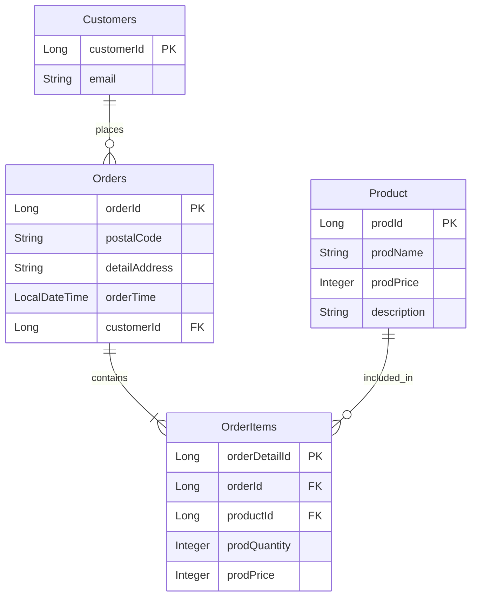

# NBE9-11-1-Team03
백엔드 11기 1차 3팀 프로젝트

☕ Grids & Circles - 원두 패키지 주문 서비스
로컬 카페 Grids & Circles의 원두 패키지 온라인 주문 시스템

📌 프로젝트 소개
고객이 웹사이트를 통해 커피 원두 패키지를 주문하는 서비스입니다. 매일 전날 오후 2시부터 당일 오후 2시까지의 주문을 모아서 처리하며, 별도의 회원가입 없이 이메일 주소로 고객을 구분합니다.

👥 팀원 소개
이름	담당
김경탁	주문/결제 (사용자 주문 생성, 결제 - 프론트 + 백엔드)
팀원2	-
팀원3	-
팀원4	-
팀원5	-
🛠 기술 스택
Backend


Frontend


📁 프로젝트 구조
```
JavaChip/
├── backend/
│   └── src/main/java/com/back/team03/javachip/
│       ├── domain/
│       │   ├── customer/
│       │   │   ├── entity/
│       │   │   └── repository/
│       │   ├── order/
│       │   │   ├── controller/
│       │   │   ├── dto/
│       │   │   ├── entity/
│       │   │   ├── repository/
│       │   │   └── service/
│       │   └── product/
│       │       ├── controller/
│       │       ├── entity/
│       │       └── repository/
│       └── global/
│           ├── config/
│           └── springdoc/
└── frontend/
    └── src/
        ├── app/
        │   ├── (customer)/           # 고객용 라우트 그룹
        │   │   ├── order/            # 주문 페이지
        │   │   ├── success/          # 결제 완료 페이지
        │   │   └── lookup/           # 주문 조회 (auth, list)
        │   ├── (admin)/              # 관리자용 라우트 그룹
        │   │   ├── login/
        │   │   ├── menu/             # 메뉴 관리
        │   │   └── admin-order/      # 주문 관리
        │   ├── layout.tsx            # 공통 레이아웃
        │   └── page.tsx              # 메인 홈페이지
        ├── components/
        │   ├── ui/                   # 공통 UI 컴포넌트
        │   ├── customer/             # 고객 전용 컴포넌트
        │   └── admin/                # 관리자 전용 컴포넌트
        ├── types/                    # TypeScript 타입 정의
        ├── lib/                      # API 호출 등 유틸리티
        └── styles/                   # 글로벌 스타일
```
🗄 ERD


🚀 실행 방법
Backend
1. 레포지토리 클론

bash
git clone https://github.com/NBE9-11-1-Team03/JavaChip.git
cd JavaChip


2. application.yml 설정 (예시)
yaml
spring:
  datasource:
    url: jdbc:mysql://localhost:3306/javachip
    username: {your_username}
    password: {your_password}
  jpa:
    hibernate:
      ddl-auto: update
    defer-datasource-initialization: true
  sql:
    init:
      mode: never
   
3. 서버 실행
   bash
   ./gradlew bootRun
   
  Frontend
  1. 패키지 설치
    bash
    cd frontend
    npm install
  3. 개발 서버 실행

bash
npm run dev

📡 API 명세  (예시)
Swagger UI: http://localhost:8080/swagger-ui/index.html
Method	URL	설명
POST	/api/v1/orders	주문 생성
GET	/api/v1/orders	전체 주문 조회
GET	/api/v1/orders?email={email}	이메일로 주문 조회
GET	/api/v1/orders/{orderId}	주문 단건 조회
GET	/api/v1/orders/delivery?email={email}	배송 묶음 조회
GET	/api/v1/products	상품 전체 조회

💡 주요 기능
사용자
* 원두 패키지 상품 조회
* 카카오 주소 API를 활용한 배송지 입력
* 주문 생성 (여러 상품 한 번에 주문 가능)
* 이메일로 주문 내역 조회
시스템
* 오후 2시 기준 배송 단위 묶음 처리
* 이메일 기반 고객 자동 생성 및 식별

📦 상품 목록
상품명	가격
에티오피아 예가체프	18,000원
콜롬비아 수프리모	16,000원
케냐 AA	20,000원
과테말라 안티구아	15,000원
